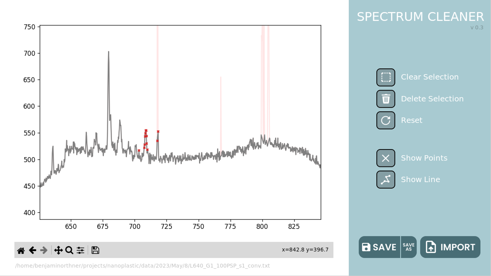

<a name="readme-top"></a>


<!-- PROJECT LOGO -->
<br />
<div align="center">
  <a href="https://github.com/benjaminorthner/spectrumCleaner">
    
  </a>

<h3 align="center">SpectrumCleaner</h3>

  <p align="center">
    SpectrumCleaner is a light Tkinter python UI to help delete cosmic events and anomalous datapoints from spectra.
    <br />
    <a href="https://github.com/benjaminorthner/spectrumCleaner">View Demo</a>
    ·
    <a href="https://github.com/benjaminorthner/spectrumCleaner/issues">Report Bug</a>
    ·
    <a href="https://github.com/benjaminorthner/spectrumCleaner/issues">Request Feature</a>
  </p>
</div>


<!-- ABOUT THE PROJECT -->
<!-- ## About The Project -->

<p align="center">
  
</p>


<!-- GETTING STARTED -->
## Getting Started

This is an example of how you may give instructions on setting up your project locally.
To get a local copy up and running follow these simple example steps.

### Prerequisites

This is an example of how to list things you need to use the software and how to install them.
* npm
  ```sh
  npm install npm@latest -g
  ```

### Installation

1. Get a free API Key at [https://example.com](https://example.com)
2. Clone the repo
   ```sh
   git clone https://github.com/benjaminorthner/spectrumCleaner.git
   ```
3. Install NPM packages
   ```sh
   npm install
   ```
4. Enter your API in `config.js`
   ```js
   const API_KEY = 'ENTER YOUR API';
   ```

<p align="right">(<a href="#readme-top">back to top</a>)</p>


<!-- MARKDOWN LINKS & IMAGES -->
<!-- https://www.markdownguide.org/basic-syntax/#reference-style-links -->

